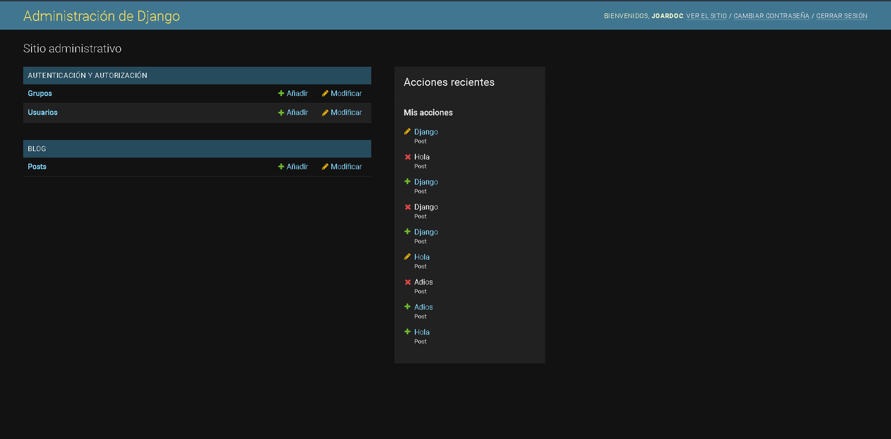

<div align="center">
<table>
    <theader>
        <tr>
            <td></td>
            <th>
                <span style="font-weight:bold;">UNIVERSIDAD NACIONAL DE SAN AGUSTIN</span><br />
                <span style="font-weight:bold;">FACULTAD DE INGENIERÍA DE PRODUCCIÓN Y SERVICIOS</span><br />
                <span style="font-weight:bold;">DEPARTAMENTO ACADÉMICO DE INGENIERÍA DE SISTEMAS E INFORMÁTICA</span><br />
                <span style="font-weight:bold;">ESCUELA PROFESIONAL DE INGENIERÍA DE SISTEMAS</span>
            </th>
            <td></td>
        </tr>
    </theader>
    <tbody>
        <tr><td colspan="3"><span style="font-weight:bold;">Formato</span>: Guía de Práctica de Laboratorio</td></tr>
        <tr><td><span style="font-weight:bold;">Aprobación</span>:  2022/03/01</td><td><span style="font-weight:bold;">Código</span>: GUIA-PRLD-001</td><td><span style="font-weight:bold;">Página</span>: 1</td></tr>
    </tbody>
</table>
</div>

<div align="center">
<span style="font-weight:bold;">GUÍA DE LABORATORIO</span><br />
</div>


<table>
<theader>
<tr><th colspan="6">INFORMACIÓN BÁSICA</th></tr>
</theader>
<tbody>
<tr><td>ASIGNATURA:</td><td colspan="5">Programación Web 2</td></tr>
<tr><td>TÍTULO DE LA PRÁCTICA:</td><td colspan="5">Django</td></tr>
<tr>
<td>NÚMERO DE PRÁCTICA:</td><td>05</td><td>AÑO LECTIVO:</td><td>2022 A</td><td>NRO. SEMESTRE:</td><td>III</td>
</tr>
<tr>
<td>FECHA INICIO::</td><td>30-May-2022</td><td>FECHA FIN:</td><td>03-Jun-2022</td><td>DURACIÓN:</td><td>04 horas</td>
</tr>
<tr><td colspan="6">RECURSOS:
    <ul>
        <li>https://www.w3schools.com/python/python_reference.asp</li>
        <li>https://docs.python.org/3/tutorial/</li>
        <li>https://developer.mozilla.org/es/docs/Learn/Server-side/Django/Models</li>
        <li>https://tutorial.djangogirls.org/es/django_models/</li>
        <li>https://pear.php.net/manual/en/standards.php</li>
        <li>https://docs.djangoproject.com/en/4.0/</li>
        <li>https://www.youtube.com/watch?v=M4NIs4BM1dk</li>
        <li>https://pypi.org/</li>
        <li>https://pip.pypa.io/en/latest/user_guide/</li>
        <li>https://packaging.python.org/en/latest/tutorials/installing-packages/</li>
    </ul>
</td>
</<tr>
<tr><td colspan="6">DOCENTES:
<ul>
<li>Richart Smith Escobedo Quispe - rescobedoq@unsa.edu.pe</li>
</ul>
</td>
</<tr>
</tdbody>
</table>

# Django

[![License][license]][license-file]
[![Downloads][downloads]][releases]
[![Last Commit][last-commit]][releases]

[![Debian][Debian]][debian-site]
[![Git][Git]][git-site]
[![GitHub][GitHub]][github-site]
[![Vim][Vim]][vim-site]
[![Java][Java]][java-site]

#

## OBJETIVOS TEMAS Y COMPETENCIAS

### OBJETIVOS

-   Crear un Proyecto Django dentro de un entorno virtual.

### TEMAS
-   Entorno virtual
-   Django
-   Modelos
-   Migraciones
-   Panel de administración

<details>
<summary>COMPETENCIAS</summary>

- C.c Diseña responsablemente sistemas, componentes o procesos para satisfacer necesidades dentro de restricciones realistas: económicas, medio ambientales, sociales, políticas, éticas, de salud, de seguridad, manufacturación y sostenibilidad.
- C.m Construye responsablemente soluciones siguiendo un proceso adecuado llevando a cabo las pruebas ajustada a los recursos disponibles del cliente.
- C.p Aplica de forma flexible técnicas, métodos, principios, normas, estándares y herramientas de ingeniería necesarias para la construcción de software e implementación de sistemas de información.

</details>

## CONTENIDO DE LA GUÍA

### MARCO CONCEPTUAL

-   pip ~ Instaladors de paquetes de Python
-   Indice de paquetes de Python ~ PyPI. Otros: CPAN->Perl, Perl->PHP


#

## EJERCICIO PROPUESTO RESUELTO
-   En este trabajo se creará un blog simple utilizando el framework Django, asi que lo primero a realizar será preparar nuestro entorno de trabajo. Cabe recalcar que todo este laboratorio ha sido guiado por los pasos e instrucciones de:
    -   https://tutorial.djangogirls.org/es/django/
    -   https://github.com/rescobedoq/pw2/tree/main/labs/lab05
-   A estas alturas ya debe estar instalado Python junto con su administrador de paquetes pip, así que en el directorio donde se va a trabajar hay que preparar el entorno virtual seguidamente del paquete Django.
    ```sh
    C:\Users\Joaquín\unsa\pweb2\lab05>python -m venv env
    C:\Users\Joaquín\unsa\pweb2\lab05>.\env\Scripts\activate
    ```
    ```sh
    (env) PS C:\Users\Joaquín\unsa\pweb2\lab05>pip install django
    ```

-   Dentro del entorno virtual. Se crea un proyecto Django que se llame ```Proyecto```
    ```sh
    (env) C:\Users\Joaquín\unsa\pweb2\lab05>django-admin startproject Proyecto
    ```
    ```sh
    Proyecto
    ├── manage.py
    └── Proyecto
        ├── asgi.py
        ├── __init__.py
        ├── settings.py
        ├── urls.py
        └── wsgi.py
    ```
-   Configurar en cuanto al idioma y el host que queremos manejar, siendo esto opcional.
    ```Proyecto/settings.py```
    ```sh
    LANGUAGE_CODE = 'es-es'
    
    ALLOWED_HOSTS = ['127.0.0.1']
    ```
-   En cuanto a la base de datos en este proyecto se va a utilizar el que viene por defecto, ```sqlite3```, con el siguiente comando ```python manage.py migrate``` lo creamos en nuestro proyecto.
    ```sh
    (env) C:\Users\Joaquín\unsa\pweb2\lab05\Proyecto>python manage.py migrate
    Operations to perform:
      Apply all migrations: admin, auth, contenttypes, sessions
    Running migrations:
      Applying contenttypes.0001_initial... OK
      Applying auth.0001_initial... OK
      Applying admin.0001_initial... OK
      Applying admin.0002_logentry_remove_auto_add... OK
      Applying admin.0003_logentry_add_action_flag_choices... OK
      Applying contenttypes.0002_remove_content_type_name... OK
      Applying auth.0002_alter_permission_name_max_length... OK
      Applying auth.0003_alter_user_email_max_length... OK
      Applying auth.0004_alter_user_username_opts... OK
      Applying auth.0005_alter_user_last_login_null... OK
      Applying auth.0006_require_contenttypes_0002... OK
      Applying auth.0007_alter_validators_add_error_messages... OK
      Applying auth.0008_alter_user_username_max_length... OK
      Applying auth.0009_alter_user_last_name_max_length... OK
      Applying auth.0010_alter_group_name_max_length... OK
      Applying auth.0011_update_proxy_permissions... OK
      Applying auth.0012_alter_user_first_name_max_length... OK
      Applying sessions.0001_initial... OK__pycache__
    ```
    ```sh
    Proyecto
    ├── db.sqlite3
    ├── manage.py  
    └── Proyecto
        ├── __pycache__
        ├── asgi.py
        ├── __init__.py
        ├── settings.py
        ├── urls.py
        └── wsgi.py
    ```
-   Con el comando ```python manage.py runserver``` ya estaria listo nuestro host, sin embargo aún nos falta crear nuestro modelo, con el cual vamos a guardar todos los post que se quieran archivar en el blog.
-   A continuación se va a iniciar la creación de nuestra aplicación "blog" con el siguiente comando ```django-admin startapp blog```, como recomendación desde ahora hay que acostumbrarse a archivar todas nuestras aplicaciones que creemos, aún si en este caso solo se va a crear una.
    ```sh
    (env) C:\Users\Joaquín\unsa\pweb2\lab06\Proyecto>md Apps
    
    (env) C:\Users\Joaquín\unsa\pweb2\lab06\Proyecto\Apps>django-admin startapp blog
    ```
    ```sh
    Proyecto
    ├── Apps
    │   └── blog
    │       ├── __init__.py
    │       ├── admin.py
    │       ├── apps.py
    │       ├── migrations
    │       │   └── __init__.py
    │       ├── models.py
    │       ├── tests.py
    │       └── views.py
    ├── db.sqlite3
    ├── manage.py
    └── Proyecto
        ├── __init__.py
        ├── __pycache__
        ├── asgi.py
        ├── settings.py
        ├── urls.py
        └── wsgi.py
    ```
-   Aún falta decirle a Django que use la aplicación creada, por eso mismo hay que configurar lo siguiente.
    ```Proyecto/settings.py```
    ```sh
    INSTALLED_APPS = [
        'django.contrib.admin',
        'django.contrib.auth',
        'django.contrib.contenttypes',
        'django.contrib.sessions',
        'django.contrib.messages',
        'django.contrib.staticfiles',
        'Apps.blog.apps.BlogConfig',
    ]
    ```
-   El cambio que se produjo fue aumentar al final la linea de código ```'Apps.blog.apps.BlogConfig',```, lo que esto acciona a Django a buscar un archivo llamado ```Apps.blog```, como se esta trabajando en un entorno virtual, debemos debemos consignar el nombre del archivo yendo a la dirección ```blog/admin.py```. El producto final debe tener el consecuente aspecto:
    ```sh
    from django.apps import AppConfig


    class BlogConfig(AppConfig):
        default_auto_field = 'django.db.models.BigAutoField'
        name = 'Apps.blog'
    ```
-   Antes de seguir hay que analizar lo que tendrá nuestras publicaciones que se realizarán en el blog, a lo señalado hay que llamarlo post, a este objeto necesitamos darle sus atributos correspondientes, como puede ser el autor, titulo, el texto escrito que en si es cuerpo del post, fechas publicadas y creadas.
    ```sh
    Post
    --------
    title
    text
    author
    created_date
    published_date
    ```
-   Ahora si, lo próximo a desempeñar tiene que ser el modelo, nos vamos a ```blog/admin.py``` y copiamos el siguiente código:
    ```sh
    from django.conf import settings
    from django.db import models
    from django.utils import timezone

    # Create your models here.
    class Post(models.Model):
        author = models.ForeignKey(settings.AUTH_USER_MODEL, on_delete=models.CASCADE)
        title = models.CharField(max_length=200)
        text = models.TextField()
        created_date = models.DateTimeField(
                default=timezone.now)
        published_date = models.DateTimeField(
                blank=True, null=True)

        def publish(self):
            self.published_date = timezone.now()
            self.save()

        def __str__(self):
            return self.title
    ```
-   Lo importante radica en la clase Post, ya que al inicio uno se percata que son importaciones de archivos externos para el funcionamientos del código.
-   En nuestra clase nos damos cuenta que hemos definido nuestro objeto post como lo indicamos anteriormente, estos atributos lo manejamos como valores, por lo tanto se tiiene que definir su tipo, tenemos texto, fecha, hora, links, etc. La información para definir valores o saber con exactitud que te proporcion de más, se puede encontrar en estas paginas informativas: 
    -   https://docs.djangoproject.com/en/2.2/ref/models/fields/#field-types
    -   https://developer.mozilla.org/es/docs/Learn/Server-side/Django/Models
-   El modelo que creamos tenemos que enviar como tablas a la base de datos, asi que usamos la linea de comando ```python manage.py makemigrations blog```.
    ```sh
    (env) PS C:\Users\Joaquín\unsa\pweb2\lab05\Proyecto>python manage.py makemigrations blog
    Migrations for 'blog':
    Apps/blog/migrations/0001_initial.py
     
    - Create model Post
    ```
    ```sh
    Proyecto
    ├── Apps
    │   └── blog
    │       ├── __init__.py
    │       ├── admin.py
    │       ├── apps.py
    │       ├── migrations
    │       │   ├── __init__.py
    │       │   ├── __pycache__
    │       │   └── 0001_initial.py
    │       ├── models.py
    │       ├── tests.py
    │       └── views.py
    ├── db.sqlite3
    ├── manage.py
    └── Proyecto
        ├── __init__.py
        ├── __pycache__
        ├── asgi.py
        ├── settings.py
        ├── urls.py
        └── wsgi.py
    ```
-   Lo que se hizo al ejecutarlo fue que se creó un archivo de migraciones en nuestro directorio de blog llamado 0001_initial.py, ahora con esto hay que prepararlo en la base de datos efectuando una nueva migración con este código ```python manage.py migrate blog```.
    ```sh
    (env) PS C:\Users\Joaquín\unsa\pweb2\lab05\Proyecto>python manage.py migrate blog
    Operations to perform:
      Apply all migrations: blog
    Running migrations:
      Applying blog.0001_initial... OK
    ```
-   Solo queda unos pocos pasos más, para que se use todas las acciones que conlleva CRUD en nuestro simple blog, se tiene que usar el administrador de Django, nos dirigimos primero a la dirección ```blog/admin.py```, y a continuación colocamos el siguiente pequeño código:
    ```sh
    from django.contrib import admin
    from .models import Post

    # Register your models here.
    admin.site.register(Post)
    ```
-   En este código se está registrando el modelo que creamos, Post. Con esto finalmente nos queda crear un super usuario, siendo este la persona que va a tener control total para así realizar cambios. Por ende tenemos que digitar la siguiente línea de código ```python manage.py createsuperuser```.
    ```sh
    (env) PS C:\Users\Joaquín\unsa\pweb2\lab05\Proyecto>python manage.py createsuperuser
    Username (leave blank to use 'joaquin'): joardoc
    Email address: jrodriguez@unsa.edu.pe
    Password: 
    Password (again):
    Superuser created successfully.
    ```
-   Con esto realizado podemos entrar al blog creado y empezar con las operaciones CRUD, para esto corremos el servidor mediante ```python manage.py runserver```.
    ```sh
    (env) PS C:\Users\Joaquín\unsa\pweb2\lab05\Proyecto> python manage.py runserver
    Watching for file changes with StatReloader
    Performing system checks...

    System check identified no issues (0 silenced).
    June 11, 2022 - 13:03:37
    Django version 4.0.5, using settings 'Proyecto.settings'
    Starting development server at http://127.0.0.1:8000/
    Quit the server with CTRL-BREAK.
    ```
-   Entramos al enlace http://127.0.0.1:8000/admin.

    *    (a) 

    *    (b) 

    *    (c) 

-   Para corroborar las operaciones del CRUD entrar al link: https://www.youtube.com/watch?v=LU30Sd5UAW8.

#

## CUESTIONARIO
-   ¿Cuál es un estándar de codificación para Python? Ejemplo: Para PHP en el proyecto Pear https://pear.php.net/manual/en/standards.php
-   ¿Qué diferencias existen entre EasyInstall, pip, y PyPM?
-   En un proyecto Django que se debe ignorar para usar git. Vea: https://github.com/django/django/blob/main/.gitignore. ¿Qué otros tipos de archivos se deberían agregar a este archivo?
-   Utilice ```python manage.py shell``` para agregar objetos. ¿Qué archivos se modificaron al agregar más objetos?

#

## REFERENCIAS
-   https://www.w3schools.com/python/python_reference.asp
-   https://docs.python.org/3/tutorial/
-   https://developer.mozilla.org/es/docs/Learn/Server-side/Django/Models
-   https://tutorial.djangogirls.org/es/django_models/
-   https://pear.php.net/manual/en/standards.php
-   https://docs.djangoproject.com/en/4.0/
-   https://www.youtube.com/watch?v=M4NIs4BM1dk
-   https://pypi.org/
-   https://pip.pypa.io/en/latest/user_guide/
-   https://packaging.python.org/en/latest/tutorials/installing-packages/
-   https://tutorial.djangogirls.org/es/django_start_project/

#

[license]: https://img.shields.io/github/license/rescobedoq/pw2?label=rescobedoq
[license-file]: https://github.com/rescobedoq/pw2/blob/main/LICENSE

[downloads]: https://img.shields.io/github/downloads/rescobedoq/pw2/total?label=Downloads
[releases]: https://github.com/rescobedoq/pw2/releases/

[last-commit]: https://img.shields.io/github/last-commit/rescobedoq/pw2?label=Last%20Commit

[Debian]: https://img.shields.io/badge/Debian-D70A53?style=for-the-badge&logo=debian&logoColor=white
[debian-site]: https://www.debian.org/index.es.html

[Git]: https://img.shields.io/badge/git-%23F05033.svg?style=for-the-badge&logo=git&logoColor=white
[git-site]: https://git-scm.com/

[GitHub]: https://img.shields.io/badge/github-%23121011.svg?style=for-the-badge&logo=github&logoColor=white
[github-site]: https://github.com/

[Vim]: https://img.shields.io/badge/VIM-%2311AB00.svg?style=for-the-badge&logo=vim&logoColor=white
[vim-site]: https://www.vim.org/

[Java]: https://img.shields.io/badge/java-%23ED8B00.svg?style=for-the-badge&logo=java&logoColor=white
[java-site]: https://docs.oracle.com/javase/tutorial/


[![Debian][Debian]][debian-site]
[![Git][Git]][git-site]
[![GitHub][GitHub]][github-site]
[![Vim][Vim]][vim-site]
[![Java][Java]][java-site]


[![License][license]][license-file]
[![Downloads][downloads]][releases]
[![Last Commit][last-commit]][releases]
